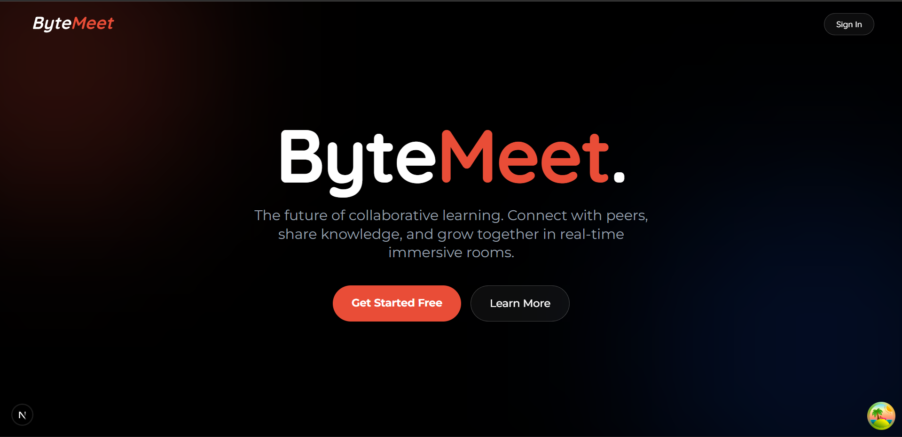
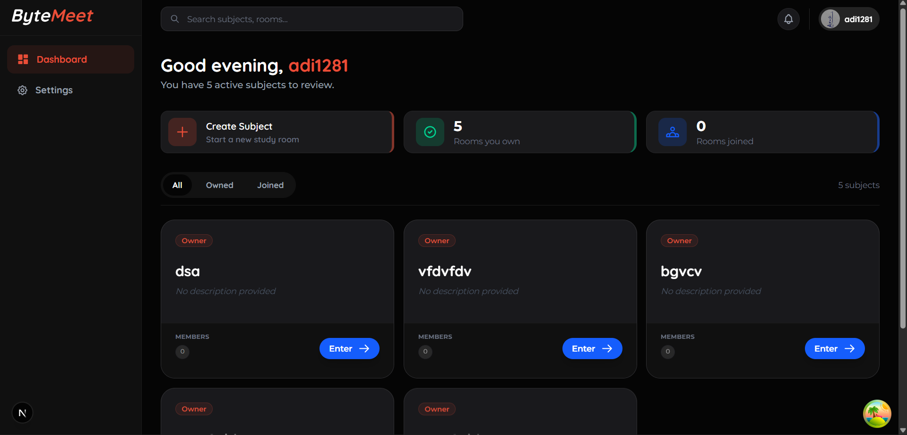
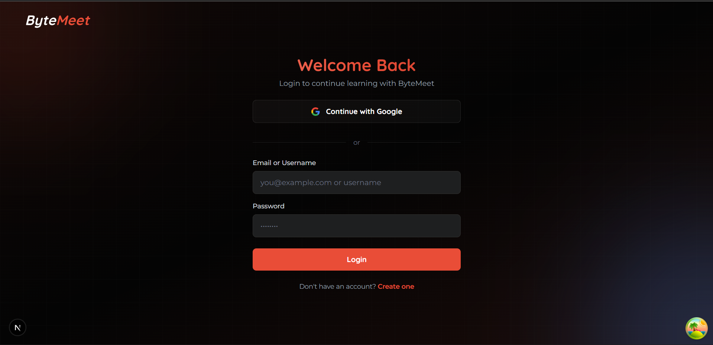
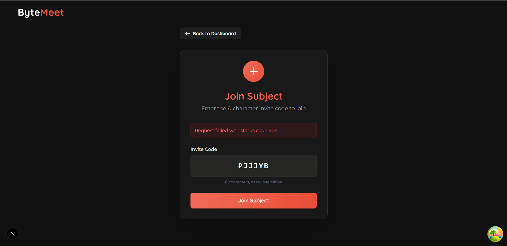

<div align="center">

# ByteMeet

### Real-time Collaborative Learning Platform

<br/>



<br/>

[](https://nextjs.org/)
[](https://www.typescriptlang.org/)
[](https://graphql.org/)
[](https://www.mongodb.com/)
[](https://supabase.com/)
[](https://livekit.io/)

<br/>

[Features](#features) • [Tech Stack](#tech-stack) • [Getting Started](#getting-started) • [Documentation](#documentation)

</div>

---

## Overview

ByteMeet is a collaborative learning platform that enables students and study groups to create virtual study rooms, communicate in real-time, and leverage AI-powered tutoring assistance. The platform combines video conferencing, instant messaging, and intelligent content generation to create an immersive learning environment.

### Key Capabilities

- **Study Rooms** — Create dedicated spaces for different subjects with invite-based access control
- **Real-time Communication** — Instant messaging with typing indicators and online presence
- **AI Tutoring** — Intelligent assistant powered by GPT-4 for explanations, code generation, and visual aids
- **Video Conferencing** — WebRTC-based video calls with screen sharing and dynamic grid layouts
- **Artifact Canvas** — View and share PDFs, code snippets, images, and AI-generated content

---

## Features

<table>
<tr>
<td width="50%">

### Subject Rooms
Create isolated study environments for different topics. Each room includes:
- Unique invite codes for member access
- Owner approval workflow
- Member management dashboard
- Real-time presence indicators

</td>
<td width="50%">

### AI Tutor
Context-aware AI assistant that provides:
- Detailed explanations
- Code generation with syntax highlighting
- Visual diagrams and artifacts
- Multi-subject expertise

</td>
</tr>
<tr>
<td width="50%">

### Video Calls
Google Meet-style video conferencing:
- Adaptive grid layout (1-9+ participants)
- Microphone and camera controls
- Screen sharing
- Speaking indicators

</td>
<td width="50%">

### Real-time Chat
Instant communication powered by Supabase:
- Message synchronization
- Redis caching for performance
- File attachments
- Typing indicators

</td>
</tr>
</table>

---

## Tech Stack

### Frontend

| Technology | Version | Purpose |
|:-----------|:--------|:--------|
| Next.js | 16.1 | React framework with App Router |
| TypeScript | 5.x | Type-safe development |
| Tailwind CSS | 4.x | Utility-first styling |
| GSAP | 3.x | Animation library |
| Apollo Client | 4.x | GraphQL state management |

### Backend

| Technology | Version | Purpose |
|:-----------|:--------|:--------|
| Node.js | 18+ | Runtime environment |
| Express | 5.x | HTTP server framework |
| GraphQL | - | API query language |
| MongoDB | 9.x | Document database |
| Mongoose | 9.x | ODM for MongoDB |

### Infrastructure

| Service | Purpose |
|:--------|:--------|
| Supabase | Real-time messaging and room management |
| Cloudinary | Media storage and CDN |
| LiveKit | WebRTC video conferencing |
| Redis | Message caching layer |
| OpenAI | AI tutoring (GPT-4) |

---

## Architecture

```
┌──────────────────────────────────────────────────────────────────────┐
│                           CLIENT (Next.js)                           │
│   ┌────────────┐   ┌────────────┐   ┌────────────┐   ┌────────────┐  │
│   │    Auth    │   │  Dashboard │   │   Room     │   │   Video    │  │
│   │   Pages    │   │    View    │   │  Layout    │   │   Call     │  │
│   └────────────┘   └────────────┘   └────────────┘   └────────────┘  │
└───────────────────────────┬──────────────────────────────────────────┘
                            │
              ┌─────────────┴─────────────┐
              │                           │
              ▼                           ▼
┌─────────────────────────┐   ┌─────────────────────────┐
│    EXPRESS + GRAPHQL    │   │        SUPABASE         │
│  ┌───────────────────┐  │   │  ┌───────────────────┐  │
│  │   Auth Resolvers  │  │   │  │   Real-time Chat  │  │
│  │ Subject Resolvers │  │   │  │  Room Management  │  │
│  │Artifact Resolvers │  │   │  │  Member Status    │  │
│  └───────────────────┘  │   │  └───────────────────┘  │
└───────────┬─────────────┘   └─────────────────────────┘
            │
            ▼
┌─────────────────────────┐   ┌─────────────────────────┐
│        MONGODB          │   │    EXTERNAL SERVICES    │
│  ┌───────────────────┐  │   │  ┌───────────────────┐  │
│  │   Users           │  │   │  │   OpenAI (GPT-4)  │  │
│  │   Artifacts       │  │   │  │   Cloudinary      │  │
│  │   Notifications   │  │   │  │   LiveKit         │  │
│  └───────────────────┘  │   │  └───────────────────┘  │
└─────────────────────────┘   └─────────────────────────┘
```

---

## Getting Started

### Prerequisites

- Node.js 18 or higher
- MongoDB instance (local or Atlas)
- Supabase project
- Redis instance (optional)

### Installation

```bash
# Clone repository
git clone https://github.com/yourusername/bytemeet.git
cd bytemeet

# Install dependencies
npm install
```

### Environment Configuration

Create `.env.local` in the project root:

```env
# Database
MONGODB_URI=mongodb://localhost:27017/bytemeet

# Authentication
JWT_SECRET=your-jwt-secret
JWT_REFRESH_SECRET=your-refresh-secret

# Supabase
NEXT_PUBLIC_SUPABASE_URL=https://your-project.supabase.co
NEXT_PUBLIC_SUPABASE_ANON_KEY=your-anon-key
SUPABASE_SERVICE_KEY=your-service-key

# Storage
NEXT_PUBLIC_CLOUDINARY_CLOUD_NAME=your-cloud-name
CLOUDINARY_API_KEY=your-api-key
CLOUDINARY_API_SECRET=your-api-secret

# AI
OPENAI_API_KEY=your-openai-key

# Video
LIVEKIT_API_KEY=your-livekit-key
LIVEKIT_API_SECRET=your-livekit-secret
NEXT_PUBLIC_LIVEKIT_URL=wss://your-livekit-instance.livekit.cloud

# Caching (Optional)
REDIS_URL=redis://localhost:6379
```

### Running the Application

```bash
# Terminal 1: Start backend server
npm run server

# Terminal 2: Start frontend development server
npm run dev
```

Access the application at `http://localhost:3000`

---

## Project Structure

```
bytemeet/
├── src/
│   ├── app/                    # Next.js App Router
│   │   ├── (auth)/             # Authentication routes
│   │   ├── (dashboard)/        # Protected routes
│   │   └── layout.tsx          # Root layout
│   ├── components/             # React components
│   │   ├── auth/               # Authentication forms
│   │   ├── canvas/             # Artifact viewer
│   │   ├── chat/               # Messaging components
│   │   ├── room/               # Room layout
│   │   ├── subject/            # Subject management
│   │   ├── ui/                 # Shared UI components
│   │   └── video/              # Video conferencing
│   ├── hooks/                  # Custom React hooks
│   ├── lib/                    # Utilities and clients
│   ├── providers/              # Context providers
│   └── types/                  # TypeScript definitions
├── backend/
│   ├── graphql/                # Schema and resolvers
│   ├── models/                 # MongoDB models
│   ├── routes/                 # REST endpoints
│   └── server.js               # Express entry point
├── docs/                       # Documentation
└── public/                     # Static assets
```

---

## Screenshots

<table>
<tr>
<td width="50%">

<p align="center"><em>Dashboard - Subject Overview</em></p>
</td>
<td width="50%">

<p align="center"><em>Room - Split Panel Layout</em></p>
</td>
</tr>
<tr>
<td width="50%">

<p align="center"><em>AI Tutor - Learning Assistant</em></p>
</td>
<td width="50%">

<p align="center"><em>Canvas - Artifact Viewer</em></p>
</td>
</tr>
<tr>
<td width="50%">

<p align="center"><em>Authentication - Login</em></p>
</td>
<td width="50%">

<p align="center"><em>Invitation - Join Flow</em></p>
</td>
</tr>
</table>

---

## Documentation

| Resource | Description |
|:---------|:------------|
| [GraphQL API](./docs/graphql-api.md) | Complete API reference |
| [Endpoint Flow](./docs/endpoint-flow.md) | Request/response documentation |

### API Playground

GraphQL Playground available at `http://localhost:5000/graphql` when running locally.

---

## Scripts

| Command | Description |
|:--------|:------------|
| `npm run dev` | Start Next.js development server |
| `npm run server` | Start Express backend server |
| `npm run build` | Create production build |
| `npm run lint` | Run ESLint |
| `npm run format` | Format with Prettier |

---


---

<div align="center">
<br/>

**ByteMeet** — Collaborative Learning, Reimagined

<br/>
</div>
