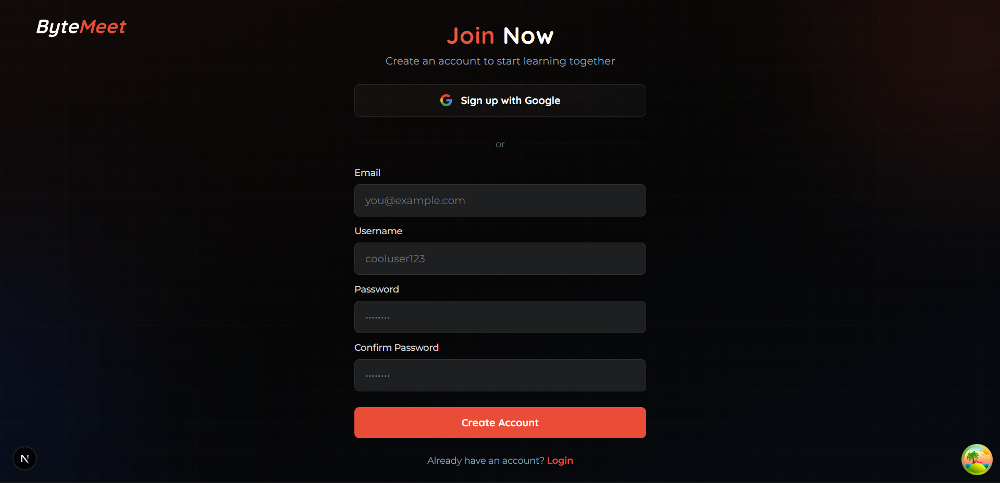

# 🎓 ByteMeet - Collaborative Learning Platform

<div align="center">


**Transform the way you study with real-time collaboration, AI tutoring, and video calls**

[](https://nextjs.org/)
[](https://www.typescriptlang.org/)
[](https://tailwindcss.com/)
[](https://www.mongodb.com/)

</div>

---

## 📋 Table of Contents

- [Overview](#-overview)
- [Tech Stack](#-tech-stack)
- [Features](#-features)
- [How It Works](#-how-it-works)
- [Project Structure](#-project-structure)
- [Getting Started](#-getting-started)
- [Screenshots](#-screenshots)
- [API Documentation](#-api-documentation)

---

## 🌟 Overview

**ByteMeet** is a collaborative learning platform designed for students and study groups. It combines the power of:

- **📚 Subject Rooms** - Create dedicated study spaces for different topics
- **💬 Real-time Chat** - Communicate with friends instantly
- **🤖 AI Tutor** - Get help from an intelligent AI assistant
- **📹 Video Calls** - Study together with Google Meet-style video conferencing
- **🎨 Canvas** - Share and view learning artifacts (PDFs, code, images)

Whether you're preparing for exams, working on group projects, or just want to study with friends, ByteMeet provides all the tools you need in one place.

---

## 💻 Tech Stack

### Frontend
| Technology | Purpose |
|------------|---------|
| **Next.js 16** | React framework with App Router |
| **TypeScript** | Type-safe development |
| **Tailwind CSS 4** | Modern utility-first styling |
| **GSAP** | Smooth animations |
| **Framer Motion** | React animations |

### Backend
| Technology | Purpose |
|------------|---------|
| **Node.js + Express** | API server |
| **GraphQL** | Flexible API queries |
| **MongoDB + Mongoose** | User data & artifacts storage |
| **Supabase** | Real-time chat & room management |

### Services
| Technology | Purpose |
|------------|---------|
| **OpenAI GPT-4** | AI tutoring |
| **LiveKit** | Video conferencing |
| **Cloudinary** | File storage & delivery |
| **Redis** | Message caching |

---

## ✨ Features

### 🏠 Subject Rooms
- Create study rooms for different subjects
- Invite friends with unique invite codes
- Owner approval system for new members
- Real-time member status updates

### 💬 Friends Chat
- Real-time messaging with Supabase
- Message caching for fast loading
- File sharing support
- Online status indicators

### 🤖 AI Tutor
- Ask questions and get intelligent responses
- Code generation with syntax highlighting
- Diagram and visual explanations
- Contextual learning assistance

### 📹 Video Calls
- Google Meet-style video grid
- Screen sharing capabilities
- Mic/camera controls
- Speaking indicators

### 🎨 Canvas Artifacts
- View PDFs, code, and images
- AI-generated content display
- Download and share artifacts

---

## 🔄 How It Works

```
┌─────────────────────────────────────────────────────────────────────────┐
│                          BYTEMEET WORKFLOW                              │
├─────────────────────────────────────────────────────────────────────────┤
│                                                                          │
│   1️⃣ SIGN UP              2️⃣ CREATE/JOIN          3️⃣ COLLABORATE        │
│   ─────────              ─────────────          ─────────────           │
│   Create account         Create a subject       Chat with friends       │
│   with username          OR join with code      Ask AI for help         │
│                                                 Share artifacts         │
│                                                 Video call together     │
│                                                                          │
│   ┌─────────────┐       ┌─────────────┐        ┌─────────────────┐      │
│   │   Login/    │  ──▶  │  Dashboard  │  ──▶   │  Subject Room   │      │
│   │   Signup    │       │  (Subjects) │        │  (Collaborate)  │      │
│   └─────────────┘       └─────────────┘        └─────────────────┘      │
│                                                                          │
└─────────────────────────────────────────────────────────────────────────┘
```

### User Flow

1. **Authentication** → Sign up with email & username or login
2. **Dashboard** → View all your subjects (owned & joined)
3. **Create Subject** → Set name, description, get invite code
4. **Invite Friends** → Share the invite code or link
5. **Collaborate** → Chat, ask AI, share screen, video call

---

## 📁 Project Structure

```
bytemeet/
├── 📂 src/
│   ├── 📂 app/                    # Next.js App Router
│   │   ├── (auth)/                # Auth pages (login, register)
│   │   ├── (dashboard)/           # Protected routes (dashboard, subject)
│   │   └── layout.tsx             # Root layout
│   ├── 📂 components/             # React components
│   │   ├── auth/                  # Login, Register forms
│   │   ├── canvas/                # Artifact viewer
│   │   ├── chat/                  # Friends & AI chat
│   │   ├── room/                  # Room layout components
│   │   ├── subject/               # Subject cards, modals
│   │   ├── ui/                    # Reusable UI components
│   │   └── video/                 # Video call components
│   ├── 📂 hooks/                  # Custom React hooks
│   ├── 📂 lib/                    # Utilities & GraphQL
│   ├── 📂 providers/              # Context providers
│   └── 📂 types/                  # TypeScript types
├── 📂 backend/                    # Express API server
│   ├── graphql/                   # GraphQL schema & resolvers
│   ├── models/                    # MongoDB models
│   ├── routes/                    # REST API routes
│   └── server.js                  # Server entry point
├── 📂 docs/                       # Documentation & screenshots
└── 📂 public/                     # Static assets
```

---

## 🚀 Getting Started

### Prerequisites

- **Node.js** 18+ 
- **MongoDB** (local or Atlas)
- **Redis** (optional, for caching)

### Environment Variables

Create a `.env.local` file in the root directory:

```env
# MongoDB
MONGODB_URI=mongodb://localhost:27017/bytemeet

# JWT
JWT_SECRET=your-secret-key
JWT_REFRESH_SECRET=your-refresh-secret

# Supabase
NEXT_PUBLIC_SUPABASE_URL=your-supabase-url
NEXT_PUBLIC_SUPABASE_ANON_KEY=your-supabase-anon-key
SUPABASE_SERVICE_KEY=your-service-key

# Cloudinary
NEXT_PUBLIC_CLOUDINARY_CLOUD_NAME=your-cloud-name
CLOUDINARY_API_KEY=your-api-key
CLOUDINARY_API_SECRET=your-api-secret

# OpenAI
OPENAI_API_KEY=your-openai-key

# LiveKit (Video Calls)
LIVEKIT_API_KEY=your-livekit-key
LIVEKIT_API_SECRET=your-livekit-secret
NEXT_PUBLIC_LIVEKIT_URL=wss://your-livekit-url

# Redis (Optional)
REDIS_URL=redis://localhost:6379
```

### Installation

```bash
# Clone the repository
git clone https://github.com/yourusername/bytemeet.git
cd bytemeet

# Install dependencies
npm install

# Start the backend server
npm run server

# In a new terminal, start the frontend
npm run dev
```

### Available Scripts

| Command | Description |
|---------|-------------|
| `npm run dev` | Start Next.js development server |
| `npm run server` | Start Express backend server |
| `npm run build` | Build for production |
| `npm run lint` | Run ESLint |
| `npm run format` | Format code with Prettier |

---

## 📸 Screenshots

### 🏠 Home Page


### 🔐 Authentication
| Login | Sign Up |
|-------|---------|
|  |  |

### 📊 Dashboard


### 🎓 Subject Room
| Split View | Canvas Artifacts |
|------------|------------------|
|  |  |

### 🤖 AI Tutor


### 📨 Invitation System


---

## 📚 API Documentation

ByteMeet uses **GraphQL** for its API. The GraphQL playground is available at:

```
http://localhost:5000/graphql
```

### Key Queries

```graphql
# Get current user
query Me {
  me { id username email }
}

# Get user's subjects
query MySubjects {
  mySubjects {
    owned { id name description }
    joined { id name description }
  }
}
```

### Key Mutations

```graphql
# Create a subject
mutation CreateSubject($input: CreateSubjectInput!) {
  createSubject(input: $input) {
    success
    subject { id name invite_code }
  }
}

# Join a subject
mutation JoinSubject($inviteCode: String!) {
  joinSubject(inviteCode: $inviteCode) {
    success
    message
  }
}
```

For complete API documentation, see [`docs/graphql-api.md`](./docs/graphql-api.md).

---

## 🤝 Contributing

Contributions are welcome! Please feel free to submit a Pull Request.

1. Fork the repository
2. Create your feature branch (`git checkout -b feature/amazing-feature`)
3. Commit your changes (`git commit -m 'Add amazing feature'`)
4. Push to the branch (`git push origin feature/amazing-feature`)
5. Open a Pull Request

---

## 📄 License

This project is licensed under the MIT License - see the [LICENSE](LICENSE) file for details.

---

<div align="center">

**Made with ❤️ for students who love to learn together**

[⬆ Back to Top](#-bytemeet---collaborative-learning-platform)

</div>
