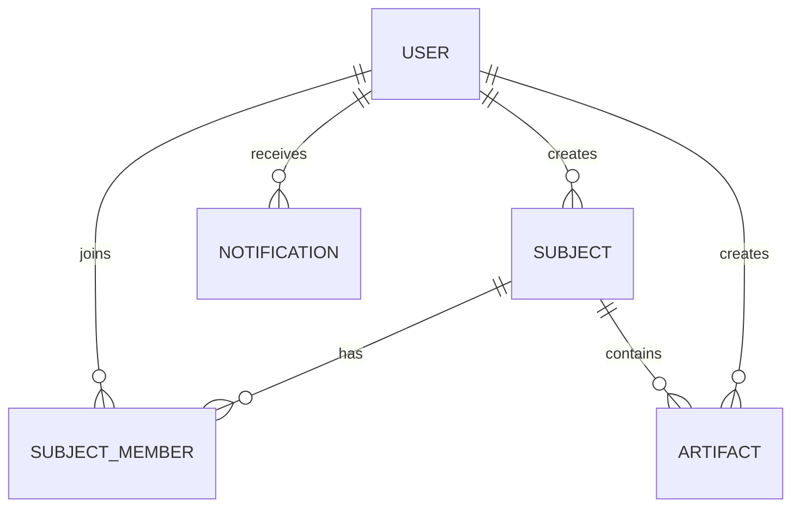

# Phase 1: REST API Discovery & Assessment Report

**Project:** ByteMeet  
**Date:** January 9, 2026  
**Status:** Complete

---

## Executive Summary

ByteMeet currently operates with **32 REST API endpoints** across 5 resource domains. The backend is built with Express.js (Node.js) using MongoDB for user/notification/artifact data and Supabase (PostgreSQL) for subjects/rooms. Authentication is JWT-based with HTTP-only cookies.

---

## REST API Inventory

### 1. Authentication Routes (`/api/auth`) - 11 Endpoints

| Method | Endpoint | Auth Required | Description | Priority |
|--------|----------|---------------|-------------|----------|
| POST | `/register` | No | Register new user | High |
| POST | `/login` | No | User login | High |
| POST | `/logout` | Yes | User logout | High |
| GET | `/me` | Yes | Get current user profile | High |
| POST | `/refresh` | No | Refresh access token | High |
| GET | `/check-username/:username` | No | Check username availability | Medium |
| GET | `/check-email/:email` | No | Check email availability | Medium |
| PUT | `/profile` | Yes | Update user profile (with file upload) | High |
| GET | `/google` | No | Initiate Google OAuth | Medium |
| GET | `/google/callback` | No | Handle Google OAuth callback | Medium |

**Request/Response Schema:**
- User object: `{ id, email, username, avatarUrl, bio, isActive, lastSeen, createdAt }`
- Auth tokens: `{ token: string, refreshToken: string }`

---

### 2. Video Routes (`/api/video`) - 1 Endpoint

| Method | Endpoint | Auth Required | Description | Priority |
|--------|----------|---------------|-------------|----------|
| POST | `/token` | Yes | Generate LiveKit video token | High |

**Request/Response Schema:**
- Request: `{ room_name: string }`
- Response: `{ success: boolean, token: string }`

---

### 3. Subject/Room Routes (`/api/subjects`) - 13 Endpoints

| Method | Endpoint | Auth Required | Description | Priority |
|--------|----------|---------------|-------------|----------|
| POST | `/` | Yes | Create new subject/room | High |
| GET | `/` | Yes | Get all user subjects (owned/joined/pending) | High |
| GET | `/:id` | Yes | Get subject by ID with members | High |
| PUT | `/:id` | Yes | Update subject (owner only) | Medium |
| DELETE | `/:id` | Yes | Soft delete subject (owner only) | Medium |
| POST | `/join` | Yes | Join subject via invite code | High |
| POST | `/:id/regenerate-code` | Yes | Regenerate invite code (owner only) | Low |
| GET | `/:id/pending-requests` | Yes | Get pending join requests | Medium |
| POST | `/:id/approve` | Yes | Approve join request | Medium |
| POST | `/:id/reject` | Yes | Reject join request | Medium |
| DELETE | `/:id/members/:userId` | Yes | Remove member | Low |

**Request/Response Schema:**
- Subject: `{ id, name, description, created_by, invite_code, is_active, created_at }`
- Member: `{ subject_id, user_id, username, avatar_url, role, status, joined_at }`

---

### 4. Notification Routes (`/api/notifications`) - 6 Endpoints

| Method | Endpoint | Auth Required | Description | Priority |
|--------|----------|---------------|-------------|----------|
| GET | `/` | Yes | Get user notifications (paginated) | High |
| GET | `/unread-count` | Yes | Get unread notification count | High |
| POST | `/mark-read` | Yes | Mark specific notifications as read | Medium |
| POST | `/mark-all-read` | Yes | Mark all notifications as read | Medium |
| DELETE | `/:id` | Yes | Delete a notification | Low |
| DELETE | `/clear-old` | Yes | Clear old notifications | Low |
| POST | `/create` | Yes | Create notification (internal/testing) | Low |

**Request/Response Schema:**
- Notification: `{ userId, type, title, message, data, isRead, createdAt }`
- Types: `join_request`, `request_approved`, `request_rejected`, `system`

---

### 5. Artifact Routes (`/api/artifacts`) - 11 Endpoints

| Method | Endpoint | Auth Required | Description | Priority |
|--------|----------|---------------|-------------|----------|
| GET | `/subject/:subjectId` | Yes | Get artifacts for subject | High |
| GET | `/subject/:subjectId/stats` | Yes | Get artifact statistics | Medium |
| GET | `/:id` | Yes | Get single artifact | High |
| POST | `/` | Yes | Create new artifact | High |
| DELETE | `/:id` | Yes | Delete artifact (soft delete) | Medium |
| POST | `/:id/view` | Yes | Track artifact view | Low |
| POST | `/:id/download` | Yes | Track artifact download | Low |
| POST | `/upload` | Yes | Upload file to Cloudinary | High |
| DELETE | `/upload` | Yes | Delete file from Cloudinary | Medium |

**Request/Response Schema:**
- Artifact: `{ subjectId, messageId, type, title, content, fileUrl, fileName, fileSize, language, isAiGenerated, createdBy, viewCount, downloadCount }`
- Types: `image`, `pdf`, `code`, `text`, `diagram`

---

## Data Relationships & Dependencies



### Key Relationships:
1. **User → Subjects**: Owner relationship via `created_by`
2. **User → Subject Members**: Membership with roles (owner/admin/member)
3. **Subject → Artifacts**: One-to-many (subjectId reference)
4. **User → Notifications**: One-to-many (userId reference)
5. **User → Artifacts**: Creator relationship via `createdBy`

---

## Authentication & Authorization Analysis

### Current Implementation:
- **Token Type:** JWT (Access + Refresh tokens)
- **Storage:** HTTP-only cookies + response body
- **Access Token Expiry:** 7 days
- **Refresh Token Expiry:** 30 days
- **OAuth Integration:** Google OAuth 2.0

### Authorization Patterns:
| Pattern | Usage |
|---------|-------|
| `authenticate` middleware | All protected routes |
| Owner-only checks | Subject update/delete, artifact delete |
| Owner/Admin checks | Approve/reject requests, remove members |
| Membership validation | Subject access, artifact access |

### GraphQL Migration Considerations:
- Need custom directives: `@auth`, `@owner`, `@role(["owner", "admin"])`
- Field-level authorization for sensitive data
- Context-based user injection

---

## Identified Issues & Optimization Opportunities

### N+1 Query Patterns (Current REST):
1. **Get subjects with members**: Separate queries for subject + members
2. **Notifications with user data**: No eager loading
3. **Artifacts with creator**: Requires populate call

### Over-fetching:
1. `/api/subjects` returns full subject objects when list may only need name/id
2. `/api/notifications` always includes full data object
3. `/api/auth/me` returns all profile fields

### Under-fetching:
1. Subject detail page requires multiple calls (subject + members + artifacts)
2. Dashboard needs owned + joined + pending subjects in 1 call (currently combined)
3. Room view needs subject + members + artifacts + notifications

### GraphQL Benefits:
- Single query for subject + members + recent artifacts
- Client-specified fields reduce payload
- Subscriptions for real-time notifications

---

## High-Traffic Endpoints (Priority List)

| Priority | Endpoint | Reason |
|----------|----------|--------|
| P0 | `/api/auth/me` | Called on every page load |
| P0 | `/api/auth/refresh` | Token refresh on expiry |
| P0 | `/api/subjects` | Dashboard main data |
| P0 | `/api/subjects/:id` | Room page load |
| P1 | `/api/notifications` | Polling/real-time |
| P1 | `/api/notifications/unread-count` | Header badge |
| P1 | `/api/artifacts/subject/:id` | Room artifacts panel |
| P2 | `/api/video/token` | Video call initiation |

---

## Database Architecture

### MongoDB (via Mongoose):
- **Collections:** Users, Notifications, Artifacts
- **Connection:** Direct MongoDB connection string

### Supabase (PostgreSQL):
- **Tables:** subjects, subject_members
- **Client:** @supabase/supabase-js

### GraphQL Resolver Strategy:
- Unified data layer abstracting both databases
- DataLoader for batching cross-database queries
- Consider migrating all to one database long-term

---

## Risk Assessment

| Risk | Likelihood | Impact | Mitigation |
|------|------------|--------|------------|
| Dual database complexity | High | Medium | Create unified data layer |
| Auth token migration | Medium | High | Parallel running period |
| File upload handling | Low | Medium | Reuse existing Cloudinary logic |
| Real-time features | Medium | Medium | GraphQL subscriptions |
| OAuth flow changes | Low | Medium | Keep REST auth initially |

---

## Recommendations for Phase 2

### Schema Design Priority:
1. Start with `User` type (core of auth)
2. Design `Subject` type with nested `members`
3. Design `Artifact` type with creator relation
4. Design `Notification` type

### Suggested GraphQL Type Structure:
```graphql
type User {
  id: ID!
  email: String!
  username: String!
  avatarUrl: String
  bio: String
  subjects: [Subject!]!
  notifications(unreadOnly: Boolean): [Notification!]!
}

type Subject {
  id: ID!
  name: String!
  description: String
  inviteCode: String
  owner: User!
  members: [SubjectMember!]!
  artifacts(type: ArtifactType, limit: Int): [Artifact!]!
  pendingRequests: [SubjectMember!]!
}

type Artifact {
  id: ID!
  type: ArtifactType!
  title: String!
  content: String
  fileUrl: String
  createdBy: User!
  viewCount: Int!
  downloadCount: Int!
}
```

---

## Phase 1 Completion Checklist

- [x] Inventory all existing REST API endpoints
- [x] Document request/response schemas for each endpoint
- [x] Map data relationships and dependencies
- [x] Identify high-traffic and business-critical endpoints
- [x] Analyze authentication mechanisms
- [x] Create discovery report

---

*Report Generated: Phase 1 Complete*  
*Next Step: Phase 2 - GraphQL Schema Design*
